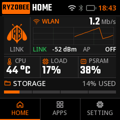
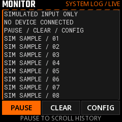

<p align="center">
  <a href="https://wiki.ryzobee.com/zh/home"></a>
</p>

<h1 align="center">RYZOBEE FIRMWARE</h1>
<p align="center"><strong>从开机界面，到你自己的 Lua 工具。</strong></p>
<p align="center">启动 · 配网 · 运行 · 创作</p>
<p align="center"><a href="README.md">English</a> · <a href="README.zh-CN.md">简体中文</a></p>
<p align="center"><a href="#从源码部署">编译与烧录</a> · <a href="docs/software/user-guide-v0.10.1/README.md">使用指南</a> · <a href="#桌面模拟器">模拟器</a> · <a href="docs/software/firmware-lua-platform.md">Lua API</a> · <a href="CONTRIBUTING.md">参与贡献</a></p>
<p align="center">V0.10.3 · ESP32-S3 · C + Lua + LVGL · 240×240 触摸界面</p>
<p align="center"><a href="https://github.com/Ryzobee/ryzobee-firmware/actions/workflows/firmware.yml"></a> · <a href="#许可证状态">许可证状态</a></p>

本仓库提供 ESP32-S3 系统固件、原生 240×240 LVGL 界面、有界 Lua 应用运行时、出厂工具和同源桌面模拟器。C 负责硬件与系统服务，用户用 Lua 编写界面和外设业务，不需要为每个工具新增专属 C 组件。RyzoBee Studio 独立维护，编译本固件不依赖 Studio。

<p align="center">
  
  
</p>

<p align="center"><em>HOME 与出厂 Lua Monitor 的同源 LVGL/SDL 模拟器截图，原始尺寸为 240×240；数值为演示数据，不代表实机测量结果。</em></p>

## 主要特色

- **设备端应用启动器：**HOME、APPS、SETTING，脚本信息、删除和 `boot.lua` 自启动；屏幕按住 **2 秒运行**，运行中长按实体 **BOOT 约 5 秒退出并返回首页**。
- **原生界面性能优先：**静态字形和图标、局部刷新、滑动取消误触、统一 LVGL 显示所有权；C 界面不经过运行时 FreeType。
- **系统统一管理连接：**受密码保护的 2.4 GHz 配网 AP、手机/电脑自适应配网页、保存网络恢复、BLE 安全配对和 NTP；手动关闭无线后，下次开机保持关闭。
- **面向 DIY 的 Lua：**受控 UI、显示/触摸和外设 API、显式 IMU 初始化、合作式协程、资源限额与退出清理。Wi-Fi/BLE 配置和凭据由 C 管理，Lua 查询连接状态。
- **应用数据持久化（V0.10.2）：**通用 [`fs.read/write/remove/list/info`](docs/software/firmware-lua-filesystem.md)，按脚本名隔离小型文本/二进制文件，支持限额、校验及失败恢复，不需要为每个工具新增 C 存档逻辑。
- **可修改的出厂示例：**系统/UART 日志监视、I²C 扫描和板载人工自检，都是 [`firmware/rootmaker/fs`](firmware/rootmaker/fs) 中可修改、删除的普通 Lua 脚本。
- **持久显示设置：**ST7789 硬件方向、亮度实时预览与保存、空闲背光管理。
- **维护基础：**USB 上传脚本、现有安全 AP 内的只读诊断、版本信息，以及 HTTPS OTA 和 A/B 应用分区基础组件。
- **同源模拟器：**通过 LVGL/SDL 运行实际 C 页面和出厂 Lua 布局，用明确的虚拟服务进行桌面交互与回归检查。

完整操作和界面截图见 [V0.10.1 用户使用指南](docs/software/user-guide-v0.10.1/README.md)。

## 硬件与依赖

当前配置针对已核对的 RootMaker 样板：**ESP32-S3、16 MiB Flash、2 MiB PSRAM、240×240 ST7789 触摸屏**。烧录前确认实际板卡版本和电气连接；这不是适用于所有 ESP32-S3 板卡的通用配置。

| 项目 | 版本 / 约束 |
| --- | --- |
| ESP-IDF | **5.5.4**，目标 ESP32-S3 |
| LVGL | **9.5.0** |
| Lua 组件 | **georgik/lua 5.5.0~7**，锁定开发快照 |
| FreeType 组件 | **2.14.3~1**；Lua 运行时支持可选，默认关闭 |
| 二维码编码器 | **espressif/qrcode 0.2.0** |
| 配置文件 | [sdkconfig.defaults](firmware/rootmaker/sdkconfig.defaults)、[dependencies.lock](firmware/rootmaker/dependencies.lock)、[partitions.csv](firmware/rootmaker/partitions.csv) |

当前 Lua 组件属于开发快照，不宣称选择了生产稳定版上游 Lua。其数值配置、资源限制和 UI API 不等同于桌面 Lua 或完整裸 LVGL。

## 从源码部署

### 1. 安装 ESP-IDF 5.5.4

Linux/macOS 先按 [Espressif 官方安装说明](https://docs.espressif.com/projects/esp-idf/en/v5.5.4/esp32s3/get-started/linux-macos-setup.html) 安装系统依赖。在不含空格的开发目录中执行：

```sh
git clone --branch v5.5.4 --recursive https://github.com/espressif/esp-idf.git esp-idf-v5.5.4
cd esp-idf-v5.5.4
./install.sh esp32s3
. ./export.sh
cd ..
```

每次新开终端都需激活该安装的 `export.sh`。Windows 请使用 Espressif 安装工具和 **5.5.4** 对应的 ESP-IDF 终端；以上安装命令面向 Linux/macOS。

### 2. 克隆并编译

在开发目录、已激活 IDF 的终端执行：

```sh
git clone https://github.com/Ryzobee/ryzobee-firmware.git
cd ryzobee-firmware/firmware/rootmaker
idf.py --version
idf.py build
```

默认配置已选择 `esp32s3`。首次编译会下载锁定组件，在 `build/` 生成应用和出厂脚本镜像。普通构建不需要 Studio、Node.js 或重新导出静态字库。确需配置时使用 `idf.py menuconfig`，再审查需要固化到 `sdkconfig.defaults` 的差异。

不要提交 `build/`、`build-host/`、`managed_components/`、生成的 `sdkconfig`、日志或凭据。审定字体输入和静态字形表是必要源码资产，不应当作编译中间产物删除。

### 3. 烧录与串口日志

**全量项目烧录会覆盖 scripts 分区，包括用户脚本、`boot.lua` 和 Lua 应用数据。** 操作前另存需要保留的内容。标准流程不擦 NVS，因此 Wi-Fi/BLE 偏好、绑定与显示配置通常保留；它不是恢复出厂设置。正常升级不要额外执行整片擦除。

使用支持数据传输的 USB 线，先关闭占用同一端口的日志监视器、Studio 或浏览器串口会话。将 `PORT` 替换为实际端口，例如 `/dev/cu.…`、`/dev/ttyACM0` 或 `COM3`：

```sh
# 在 firmware/rootmaker 中执行，保持 ESP-IDF 环境已激活。
idf.py -p PORT flash monitor
```

该命令写入 bootloader、分区表、OTA 元数据、应用和 scripts 镜像。按 **Ctrl+]** 退出监视器。启动后在 **SETTING → VERSION** 核对 **V0.10.3**。

支持的板卡通过 DTR/RTS 自动进入下载并复位。连接失败先检查端口、线缆和占用，保留原始错误，不要仅凭一次失败判断不支持自动下载。确需手动下载时，按板卡 BOOT/复位方法进入下载模式后重试同一烧录范围。按住 BOOT 复位与系统运行时的 5 秒退出不是同一操作。

## 首次使用与 Lua 开发

1. 正常上电等待初始化。没有 `boot.lua` 时进入 HOME；设置自启后，初始化完成直接进入用户脚本。
2. 打开 **SETTING → WI-FI → START WI-FI SETUP**，扫描设备实时二维码。**必须使用手机系统自带的扫码器或相机；绝大多数手机的系统相机支持此功能，不要使用微信、支付宝等第三方“扫一扫”。** 此码用于加入设备热点，随后用浏览器访问设备显示的地址，通常为 `http://192.168.4.1`。
3. 在 APPS 中打开 APP INFO，按住 **HOLD 2S TO RUN** 运行。运行中长按 BOOT 约 5 秒请求退出并清理，不是严格硬实时复位。
4. 无须重编译即可通过 USB 上传 Lua。从仓库根目录运行，使用 IDF Python 环境并确保串口空闲：

```sh
python firmware/rootmaker/tools/board_lua.py --port PORT \
  put firmware/rootmaker/scripts/ui_demo.lua --name ui_demo.lua
```

该命令写入或覆盖 `ui_demo.lua`，不会自动运行或设置自启；从 APPS 启动即可。操作外设前阅读 [Lua 平台契约](docs/software/firmware-lua-platform.md)、[外设 API](docs/software/firmware-lua-peripherals.md)，参考出厂脚本，并核对接线、供电和电平。

V0.10.3 包含 [`boot.poll()`](docs/software/firmware-lua-boot-events.md)
单击、双击及 3 秒长按事件，C 所有的约 5 秒退出保留；为了退出而持续按住也可能
先收到 3 秒事件。可参考[有界 Lua 示例](firmware/rootmaker/scripts/boot_events_demo.lua)。
旧 V0.10.2 构建不保证包含该接口；模拟器也需要接入输入后端才能使用实体按键事件。

## 桌面模拟器

先成功完成目标固件编译，再为本机安装 SDL2、CMake、Ninja 和 Clang/GCC。从仓库根目录执行：

```sh
sh firmware/rootmaker/tools/build_ui_simulator.sh "$PWD/firmware/rootmaker/build"
# macOS：
open firmware/rootmaker/build-host/simulator/v5_simulator.app
```

脚本编译同源模拟器并运行 Host 检查。重建后退出旧窗口再打开，运行中的旧进程不会热更新。当前流程已在 macOS 使用，其它系统可能需要适配。更多内容见[模拟器说明](firmware/rootmaker/host/simulator/README.md)。

**模拟器不是实机验收。** 网络、传感器、文件和二维码凭据采用明确夹具；不能证明 BLE 互通、真实触摸延迟、屏幕信号/颜色、外设接线或扫码成功。不要用截图二维码配置设备。

## 当前能力边界

- **BLE 为 HID / Consumer Control 开发验证版：**提供七种媒体控制，不是键盘、鼠标或任意 Lua GATT 服务。没有正式 VID/PID，不声明完整 HOGP 合规，不保证所有 iPhone 系统版本能在设置中发现。其它 Lua 应用不被限制为 HID。
- **默认没有在线 OTA 更新源：**组件已存在，但 `CONFIG_RYZ_OTA_URL` 为空，不能把状态样例页理解为可用更新服务。
- **FreeType 默认关闭：**`CONFIG_RYZ_LUA_FREETYPE=n`；即使为 Lua 启用，C 界面仍用静态字形。离线字体导出和测试可独立使用 FreeType。
- **运行空间有边界：**同时一个用户 Lua 作业、每作业 256 KiB Lua 堆、单脚本最多 16 KiB、scripts 分区 1 MiB。内部 RAM/PSRAM 可用量随服务而变，不等于整颗芯片内存都可分给一个脚本。
- 电池百分比、FILE SERVER 和部分维护入口尚不可用；NTP 当前使用 UTC。原生界面为英文与审定静态字符集，不支持任意多语言字体显示。

## 仓库结构

| 路径 | 内容 |
| --- | --- |
| [firmware/rootmaker](firmware/rootmaker) | ESP-IDF 工程、C 组件、板级配置、测试与 USB 工具 |
| [firmware/rootmaker/fs](firmware/rootmaker/fs) | 打包进镜像的出厂 Lua |
| [firmware/rootmaker/host](firmware/rootmaker/host) | 共用运行时的 Host 适配、像素检查与 SDL 模拟器 |
| [assets/typography](assets/typography) | 审定字体来源与第三方声明 |
| [docs/software](docs/software) | 当前用户指南、API 和架构文档 |
| [.github](.github) | 编译工作流与 PR 模板 |

## 贡献与合并规范

提交前阅读 [CONTRIBUTING.md](CONTRIBUTING.md)。commit 和 PR 标题使用固定 emoji/前缀配对，范围必填：

```text
🐛 fix(ui): 修复应用详情返回按钮的触摸判定
```

`main` **仅通过 PR 更新**，管理员也遵守。合并前必须通过 **Firmware version** 和 **ESP32-S3 build**。每个 PR 都必须递增 `PROJECT_VER`，纯文档修改也不例外；CI 同时核对实际固件产物与原生 VERSION 页面。可以先创建 PR 再等待 CI，门禁限制的是**合并**而非创建 PR。简介以中文为主，写明新增、删除、修改、注意事项、版本变化和验证。编译通过不等于实机功能验收通过。

## 许可证状态

维护者尚未选定项目级许可证，仓库公开不等于已授予开源许可。第三方依赖、字体及其它资产保留各自许可证与声明；请勿删除，也不要假设一个项目许可证覆盖全部内容。
