# RyzoBee V0.10.1 用户使用指南

**RootMaker · 从设备菜单到自己的 Lua 小工具**  
版本：V0.10.1｜说明书日期：2026-09-15｜界面语言：英文｜说明语言：中文

这份指南面向使用当前定制固件的 RootMaker 用户。它说明设备能做什么、怎样操作，以及哪些功能还处于开发阶段。屏幕上的英文名称保留原样，方便对照操作。

> **先读这些要点**  
> 运行脚本：在 APP INFO 按住 **HOLD 2S TO RUN 2 秒**。退出脚本：运行期间按住实体 **BOOT 约 5 秒**。  
> 本指南图片由当前固件同源 LVGL/SDL 模拟器生成，原始尺寸为 240×240；网络、文件名、数量、密码、验证码、传感器值均为示例，**不要扫描文档里的二维码，也不要输入示例验证码**。请使用设备实时显示的信息。  
> **扫码务必使用手机系统自带的扫码功能，绝大多数手机直接打开系统相机即可识别。不要使用微信、支付宝等第三方 App 的“扫一扫”代替。**  
> V0.10.1 是本次更新后的源码和构建版本；仅阅读本指南不会升级设备。设备实际版本请在 VERSION 中确认。

## 01 · 这套固件的作用

RyzoBee 固件把 RootMaker 变成一个可以脱离电脑使用的触摸式 Lua 工具平台：系统负责可靠启动、显示、网络与配对、文件和运行资源管理；用户通过 Lua 编写自己的界面和外设逻辑。

你可以用它查看设备状态、配置无线连接、选择和运行脚本、设置开机脚本，以及使用随固件附带的日志、I²C 扫描和人工自检工具。开发时通过 USB 将脚本上传到设备，日常使用则直接从屏幕启动。

| 层次 | 固件负责什么 | 用户如何使用 |
| --- | --- | --- |
| 原生系统界面 | HOME、APPS、SETTING、错误页和触摸交互 | 通过屏幕进入功能和管理应用 |
| 无线与时间 | Wi-Fi 配网、连接恢复、BLE 安全配对、联网校时 | 在原生设置中配置；Lua 查询连接状态 |
| 应用管理 | 脚本文件、信息读取、自启动、单任务运行和退出清理 | 上传、选择、运行或删除 `.lua` |
| Lua 平台 | 有界 UI、显示/触摸、外设 API、协程及运行限制 | 用普通 Lua 编写工具，不需要为每个工具增加专属 C 组件 |
| 维护基础设施 | 诊断报告、固件版本、底层 OTA 组件 | 当前使用诊断和版本查看；在线 OTA 尚未开放 |

当前原生 UI 使用静态字形以降低渲染开销，Lua 默认也使用静态字体。FreeType 可选组件默认关闭。**这不是完整桌面操作系统，也不是对全部 LVGL API、任意字体和所有 ESP-IDF 外设功能的无边界开放。**

## 02 · 准备设备与首次上电

本指南对应已核对的 RootMaker 样板：ESP32-S3、240×240 触摸屏、16 MiB Flash、2 MiB PSRAM。不同硬件版本的接口和供电能力，应以该版本资料为准。

1. 准备支持数据传输的 USB-C 线缆。仅供电线可以让设备亮屏，但不能用于上传或烧录。
2. 初次使用时先不接未知外设，接好屏幕并给设备稳定供电。
3. 正常上电不要按住 BOOT。启动画面出现后，系统继续初始化并尝试恢复允许恢复的无线连接。
4. 没有自启动脚本时，准备完成后进入 HOME；已设置 `boot.lua` 时，准备完成后直接运行该脚本。


启动期间的英文状态文字会反映 Wi-Fi 扫描、连接、成功或跳过等步骤。进度动画表示系统正在准备，不应把动画位置理解成精确的总耗时百分比。

### 开机时无线会怎么处理

| 已保存状态 | 本次开机行为 |
| --- | --- |
| Wi-Fi 被用户手动关闭 | 保持关闭，不扫描、不尝试连接 |
| Wi-Fi 允许开启，但未保存网络 | 启动配网 AP |
| 已保存 Wi-Fi 网络 | 先扫描目标 SSID；精确匹配到 2.4 GHz 网络才尝试连接 |
| 未发现保存的网络，或启动连接失败/超时 | 回退配网 AP，保留已保存凭据 |
| BLE 被手动关闭，或没有保存绑定 | 保持关闭，不自动开启新配对窗口 |
| BLE 允许开启且已有绑定 | 尝试恢复；约 10 秒未恢复则本次转为 OFF，保留绑定 |

启动连接等待和网页配网不是同一个超时流程：前者约 10 秒，网页提交连接有独立的约 60 秒超时。连接不上时不必无限等待开机动画。

### 硬件操作安全

- 外接模块先断电接线，核对实际接口针脚和方向；不要只凭接口外形判断电气兼容。
- GPIO/串口采用 3.3 V 逻辑，不要直接接 5 V TTL 或 RS-232 电平。
- 外设需要共地；电机、大功率灯等负载还需核对电源和驱动，不应直接挂到 GPIO。
- **BOOT 长按退出是在系统已运行时使用**。按住 BOOT 再上电可能进入下载模式，与退出脚本不同。

## 03 · 导航与触摸操作

底部主导航有 `HOME`、`APPS`、`SETTING`。在主页面可通过导航或左右滑动切换；它不是无限循环轮播。子页面通常使用左上角返回箭头。长列表、信息正文和日志使用上下拖动。


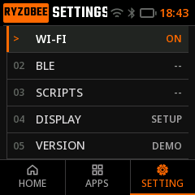

| 操作 | 含义 |
| --- | --- |
| 短按列表项 | 选择或打开详情，不等于运行脚本 |
| 上下拖动正文/列表 | 滚动内容；应从内容区域起手 |
| 左右滑动主页面 | 切换主导航，滑动不应触发列表里的脚本 |
| APP INFO 按住运行按钮 2 秒 | 达到门槛后提交一次运行请求 |
| 长按实体 BOOT 约 5 秒 | 请求结束当前脚本，清理后返回 HOME；普通系统子页也可回 HOME |
| 灰色、N/A 或等待中的按钮 | 当前不可用；反复点击不会使未实现的功能生效 |

Wi-Fi 的 `START WI-FI SETUP` 与 BLE 的 `START PAIRING` 实际触摸区域已扩大至 **200×44 像素**，图形本身仍为 184×28。可以点击按钮边缘附近；拖动仍会取消点击。不要将手指滑过危险确认按钮当作点击方式。

## 04 · 看懂 HOME 首页

首页用于快速了解系统状态，不替代专业性能测试或电气测量。

| 区域 | 读法与限制 |
| --- | --- |
| Logo / IDLE 等状态 | 当前系统/任务状态提示；脚本开始后通常切入脚本自己的界面 |
| WLAN 与趋势图 | 显示固件采样的网络流量变化和无线状态；不是互联网测速结果。点击 WLAN 区域可进入 Wi-Fi |
| CPU 温度 | 芯片内部温度观察值，不是室温或外接探头温度 |
| LOAD | 当前统计窗口的 CPU 负载比例，不是帧率 |
| PSRAM | **外部运行内存的已用百分比**；不是空闲百分比，也不是内部 RAM 剩余字节数 |
| STORAGE / USED | 脚本文件系统的已用比例，包含文件系统及元信息占用；不是整颗 Flash 占用 |
| 时间 | 联网 NTP 校时后显示。当前固件为 UTC，未有效校时显示 `--:--` |
| `--`、`N/A` | 数据暂不可用或后端未提供，不能当作数值 0 |

当前 HOME 保留固定 WLAN 趋势，不提供点击温度、LOAD、PSRAM 来切换主图的功能。不要把模拟器里一组固定数值当作实机负载或可用容量。

当前脚本分区为 **1 MiB**，不是 16 MiB 整片 Flash。小文件已占空间但不足 1% 时，可以显示 `<1% USED`。PSRAM 用于运行数据，增加脚本文件主要消耗 STORAGE；运行脚本才会进一步使用运行内存。

## 05 · Wi-Fi 配网：手机与电脑

Wi-Fi 由系统设置管理，Lua 不直接读取密码或修改配网配置。设备只连接 **2.4 GHz Wi-Fi**，不支持 5 GHz 网络。

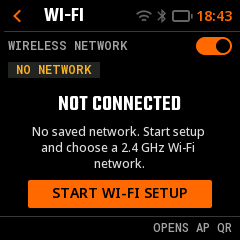

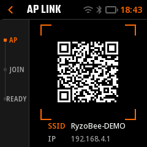

### 用手机完成首次配网

1. 打开 `SETTING → WI-FI`。如果显示 `RADIO OFF`，先开启右上角开关。
2. 未连接时点 `START WI-FI SETUP`；已经连接但要换网络时，点 `PROVISION`。
3. 等待设备 AP 准备好并出现二维码。打开**手机系统自带相机或系统扫码器**，扫描**设备屏幕上的二维码**，点击系统弹出的加入 Wi-Fi 提示，加入 `RYZOBEE-XXXX`。绝大多数手机的系统相机支持此功能；不要使用微信、支付宝等第三方 App 扫码。
4. 手机提示“此 Wi-Fi 没有互联网”时，保持连接。此热点用于设备本地配置，不是上网路由器。
5. 若系统没有自动弹出配网页，打开浏览器，输入设备显示的地址，通常是 `http://192.168.4.1`。
6. 在网络列表选择目标 2.4 GHz SSID，输入密码，点 `CONNECT DEVICE`。
7. 等待网页显示 `WI-FI READY / DEVICE ONLINE`，核对 SSID 和分配的 IPv4。设备就绪页可点 `GO TO HOME`。
8. 配网结束后，手机可切回平时使用的网络。设备端以实际连接状态为准，不以手机是否还停留在网页判断成功。

**这张 AP 二维码是 Wi-Fi 入网码，不是网页链接。** 正常配网不需要寻找第二张网页二维码；加入设备热点后用浏览器访问屏幕 IP 即可。

如果相机没有出现入网提示，先确认使用的是系统相机，并检查二维码识别功能是否开启，或改用手机系统自带的扫码器。保持完整二维码在取景框内，调整距离与角度以避开屏幕反光。

### 用电脑配置

1. 先让设备进入 AP 配网页。
2. 将电脑 Wi-Fi 连接到同一 `RYZOBEE-XXXX` 热点。AP 密码没有通用默认值：首次生成 12 位随机密码并保存在设备中，凭据包含在实时入网二维码里。
3. 先用**手机系统相机或系统扫码器**扫描设备二维码并加入热点；如果手机系统支持查看已连接网络密码或分享凭据，可据此让电脑连接同一热点。当前原生 AP 页不直接显示明文 AP 密码；若手机没有提供相应功能，可先直接用手机完成配网。不要猜 `12345678` 等密码，也不要把二维码上传给在线解码服务。
4. 在电脑浏览器输入屏幕上的 IP。桌面网页和手机网页是同一套设备服务，布局不同，后续均按“选网络 → 密码 → CONNECT DEVICE”完成。

### 网页控件与失败处理

| 名称 | 作用 |
| --- | --- |
| AVAILABLE 2.4G NETWORKS | 当前扫描结果；列表最多保留较强的 16 条，可滚动 |
| RESCAN | 重新扫描；具体位置随手机/桌面布局变化 |
| 2.4G FILTER / 2.4G ONLY | 固定频段说明，**不是切换按钮** |
| SHOW | 暂时显示你输入的密码，请注意旁观者 |
| CONNECT DEVICE | 提交凭据并开始连接；加密网络密码为 8～63 字节，开放网络无须密码 |
| CANCEL | 网页端取消当前连接尝试；设备屏幕上的同名连接取消入口目前未开放 |
| RETRY / CHANGE NETWORK | 失败后重试或重新选网。没有扫描到网络时，网页会提供手动 SSID 输入 |

> **保存时机很重要：**提交连接时会先保存新凭据，再尝试连接。连接失败或取消，不等于自动恢复旧网络密码。重新配网本身也不等于清空配置。

如果浏览器打不开，请先核对手机/电脑是否仍在设备 AP、地址是否来自当前屏幕，以及 VPN/代理是否干扰本地访问。若列表没有目标网络，核对路由器 2.4 GHz、信号和 SSID；不要把 5 GHz-only 网络重复提交给设备。

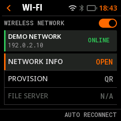

`NETWORK INFO` 可查看连接信息。`HOLD TO VIEW` 在允许时按住显示已保存的目标网络密码，松开隐藏；这是敏感内容。`FORGET NETWORK`、`FILE SERVER` 和网页的 `OPEN DEVICE DASHBOARD` 在本版尚不可用。**配网网页不能上传 Lua。**

## 06 · BLE 配对、重连与开发版限制

Wi-Fi 与 BLE 是两个独立设置。关闭 BLE 不会删除已保存绑定；已有绑定也不代表当前连接成功。

### 第一次配对

1. 在手机/电脑开启蓝牙；设备进入 `SETTING → BLE`，开启右上角开关。
2. 未绑定时点 `START PAIRING`，进入 **30 秒**新配对窗口。
3. 在手机/电脑蓝牙界面查找 `RyzoBee` 并发起连接。
4. 设备出现 `VERIFY CODE` 时，核对两端六位数字相同，再在两端确认；不同则点 `REJECT`。
5. 等待保存完成，出现 `PAIRED / BOND SAVED` 后点 `DONE`。保存过程中不要断电。
6. 窗口超时后按页面提示重试。设备不会无限期对新手机开放配对。

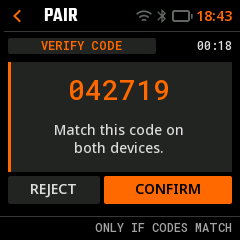

### 换手机或重新建立绑定

在 BLE 总览选择 `PAIR NEW`（已连接总览显示为 `PAIR MODE`），进入 `REPLACE BOND?` 后点 `CONTINUE`。此操作会先删除旧绑定，再开启新配对窗口；随后取消新配对**不会恢复旧绑定**。旧手机中也应手动“忽略/忘记”旧 RyzoBee 记录，再发起新配对。

如果只是临时不用蓝牙，关闭右上角开关即可；如果确实要解除绑定，使用 `FORGET DEVICE` 并确认。

| 状态 | 意义 |
| --- | --- |
| SAVED | 已保存绑定；可能尚未连接 |
| LINKED | 链路已经连接；不等于所有业务服务都就绪 |
| SERVICE -- | 通用应用服务就绪字段尚未实现；不能单凭它判断 HID 成败 |
| PAIR TIMEOUT / PAIR FAILED | 配对到期或失败，按页面提示重试 |
| SAVING / COMMITTING | 正在完成持久保存，等待结果，不要重复发起 |
| OFF / N/A / ERR | 分别表示关闭、服务不可用或明确错误，并非同一个状态 |

### 为什么 BLE 扫描工具能看到，iPhone 设置却未必看到

当前固件是 **Generic HID / Consumer Control 开发验证版**，尚无正式 VID/PID，不声明完整 HOGP 合规，也不保证所有 iPhone 系统版本都能在系统设置列出设备。扫描工具看到广播，只说明它收到了广播；不能证明系统设置兼容性或配对已经完成。

若系统设置没显示，先确认处于新配对窗口而不是仅有 `SAVED` 状态，再检查两端旧绑定。可用 BLE 扫描工具区分“没有广播”和“广播被系统界面过滤”。不要因为能在扫描 App 配对，就将其写成无 App 配对已通过。

HID 目前只提供播放/暂停、停止、上一曲、下一曲、静音、音量加/减这七类媒体操作。它不是键盘、鼠标、任意 BLE 数据通道或通知阅读器。**用户的 Lua 应用仍可做传感器、显示和工具，不被限制为 HID 应用。**

## 07 · APPS：浏览、运行与删除脚本

进入底部 `APPS`，显示实际 Lua 文件列表。首次完整烧录通常包含三份出厂工具；自行上传、删除或设置 `boot.lua` 后数量会变化。

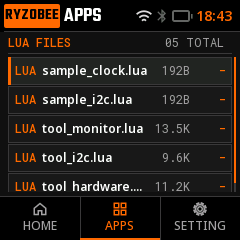

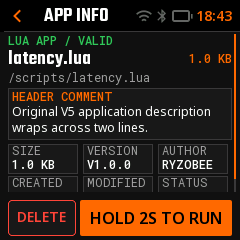

### 打开详情并运行

1. 上下拖动列表找到文件，短按打开 `APP INFO`。
2. 查看脚本名称和 `HEADER COMMENT`，必要时上下拖动详情正文。
3. 将手指稳定按在 `HOLD 2S TO RUN` 上。橙色背景从左向右填满，文字显示当前持续时间。
4. 达到 2 秒后系统提交一次运行请求。提前松手或滑动会取消；无需连续点击或反复按住。
5. `PREPARING` 表示系统在准备运行，不等于脚本已经完成。脚本可能显示自己的 240×240 页面，也可能只是输出文字后结束。

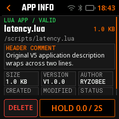

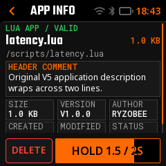

原生运行按钮采用局部刷新，不在每次进度更新时重画整页。用户脚本的实际流畅程度仍取决于代码、外设等待和绘图量。

### 退出运行

运行过程中按住实体 **BOOT 约 5 秒**。固件会请求停止任务、清理本任务资源，然后返回 HOME；不需要脚本自己绘制系统退出按钮。按键防抖、调度和清理会带来额外等待，因此不是严格 5.000 秒硬复位。

脚本自行正常结束也会回 HOME。退出自启动脚本不会删除 `boot.lua`，下次开机仍会自启动；若要停止今后的自启动，按下一节清除。

### 元信息怎么来的

| 字段 | 来源 |
| --- | --- |
| 名称、SIZE、路径 | 文件存储信息；SIZE 是源码体积，不是运行堆峰值 |
| HEADER COMMENT、AUTHOR、VERSION | Lua 文件开头的规范注释 |
| CREATED、MODIFIED | 固件存储服务维护的隐藏时间记录，按 UTC 显示 MM-DD |
| VALID | 当前源码可读取并通过相应边界检查，不保证语法、外设接线或运行逻辑正确 |

日期为 `-` 时说明相应日期未知，不等于文件无效。出厂脚本日期是镜像打包时间；正常上传无须手工制作时间文件。覆盖时保留已知创建时间，修改时间取设备可信时钟；未校时时可能未知，之后联网不会伪造回填历史时间。

### 删除

在详情点 `DELETE`，核对文件名，在独立确认页再次确认。出厂工具同样允许修改和删除。**删除不可撤销，普通重启不会自动恢复出厂脚本。**需要保留时先从电脑保存源码副本。

## 08 · SCRIPTS：设置与清除开机应用

自启动的作用是让设备开机后直接进入你的应用，不先停在 HOME。它以独立的 `boot.lua` 文件实现。

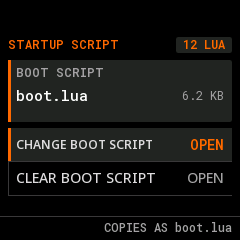

### 设置开机脚本

1. 先从 APPS 手动运行目标脚本，确认可以正常使用和通过 BOOT 退出。
2. 进入 `SETTING → SCRIPTS → CHANGE BOOT SCRIPT`。
3. 在 `SELECT SCRIPT` 中选定文件，点 `SET AS BOOT SCRIPT`。
4. 等待 `BOOT SCRIPT SET / CHANGES SAVED`。选择 `LATER` 返回；当前 `RESTART NOW` 未开放，需要手动重新上电/重启。
5. 下次启动动画和系统准备完成后，直接运行 `boot.lua`。

这是**复制**，不是快捷方式：原 `my_app.lua` 被复制成另一份 `boot.lua`。之后只修改原文件不会自动更新自启副本，需要重新执行“设置开机脚本”。列表因此多一份文件、STORAGE 增加是正常现象。

### 清除自启动

先长按 BOOT 退出脚本，进入 `SETTING → SCRIPTS → CLEAR BOOT SCRIPT`，再确认 `CLEAR BOOT`。这只删除 `boot.lua`，保留其它脚本，不是“全部删除”。清除后下次开机进入 HOME。

如果开机脚本报错，先使用错误页 `HOME` 返回，再修改或清除 `boot.lua`，不要把反复断电当作修改脚本的方法。

## 09 · 出厂工具一：Monitor 日志与串口接收

文件：`tool_monitor.lua`。它是普通可编辑 Lua 工具，不是隐藏在固件中的专用 C 工具页面。默认进入 `SYSTEM LOG / LIVE`，用于观察固件提供的日志。


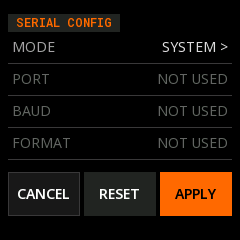

### 查看与拖动日志

- `PAUSE` 冻结当前可见历史，然后在日志区上下拖动阅读。
- `RESUME` 回到最新数据。暂停只是冻结视图，后台仍继续接收。
- `CLEAR` 清空这个工具的显示历史，不删除脚本、不清空整个文件系统。
- 本工具最多保留 64 行，长行按约 28 字符折行；非打印字节显示为 `[XX]`，不是完整任意 UTF-8 文本终端。
- `HISTORY OVERWRITTEN` 表示旧历史已被覆盖；`CAPTURE LOSS POSSIBLE` 表示可能丢数据。它不是保证无损采集的逻辑分析仪。

### 接收外部 UART

1. 先确认对端是 3.3 V TTL UART，断电接线。
2. 对端 TX 接所选端口的 RX，并连接 GND。该工具为 **RX-only**，不会发送 UART 数据。
3. 进入 `CONFIG`，模式改为 `RSPORT RX`。
4. 设置 `PORT`、`BAUD`、`FORMAT`。子页 `USE ...` 先更新草稿，返回配置页点 `APPLY` 才应用。
5. `SWAP` 可交换选用的接收脚方向；请根据界面标明的 RX 核对实际接线。
6. 返回日志页观察。乱码时先核对波特率、格式、共地、电平和接收脚，而不是盲目提高波特率。

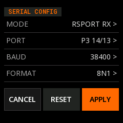

| 端口 | 当前映射与限制 |
| --- | --- |
| P1 | GPIO15 / GPIO16 |
| P3 | GPIO13 / GPIO14 |
| P4 | GPIO17 / GPIO18 |
| P2 | GPIO19 / GPIO20，当前标记 USB 并禁用 |

提供 11 个波特率预设和 8N1、8N2、8E1、8O1、7E1、7O1 六种格式。`RESET` 是把配置草稿恢复为当前已应用配置，**不是恢复出厂设置**。配置和历史不跨次运行持久保存。退出仍用 BOOT 5 秒。

## 10 · 出厂工具二：I²C 地址扫描

文件：`tool_i2c.lua`。用于检查指定总线上哪些地址有应答，不能仅凭 ACK 判断某个传感器已经正常工作。

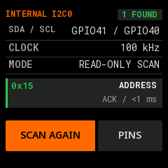

1. 从 APPS 运行工具，默认扫描板载 INTERNAL I2C0：SDA41 / SCL40，100 kHz。
2. 扫描范围是 0x08～0x77，结果列出 ACK 地址和耗时；上下拖动可查看结果。
3. `SCAN AGAIN` 重新扫描；扫描时按钮为 `CANCEL`，取消后恢复上一次结果。
4. 扫外接总线时进入 `PINS`，选择合法且不同的 SDA/SCL 和 100/400 kHz，完成后点 `SCAN PINS`。
5. 用 `TAP TO USE INTERNAL BUS` 返回板载总线。

板载总线与触摸/IMU 共用，当前只允许地址探测，不开放板载总线寄存器写入。外接器件应检查供电、共地和上拉，避免冲突地址；扫描本身会产生总线通信，不应在不清楚设备行为时任意操作敏感总线。

`0` 个地址不自动表示固件坏了。先检查你选择的是内部还是自定义总线，再核对引脚、上拉、供电与器件地址。`RETRY CLOSE` 只重试资源释放，不是重新扫描或修复硬件。

## 11 · 出厂工具三：RootMaker 人工自检

文件：`tool_hardware.lua`。这是需要人观察和确认的板载自检示例，不是自动出厂检验报告。

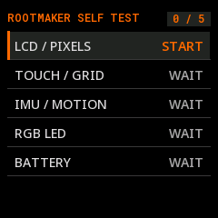

| 项目 | 怎样操作 | 结果边界 |
| --- | --- | --- |
| LCD / PIXELS | 观察红绿蓝白、条纹等图样；正常点 CONFIRM PASS，异常点 FAIL | 必须看真实屏幕，软件完成绘制不代表像素完好 |
| TOUCH / GRID | 逐一点亮 9 个格子，达到 9/9 后确认 | 只是当前格点测试，不是全屏精度标定 |
| IMU / MOTION | 逐轴倾斜，观察 XYZ 加速度和新样本；满足条件后 MOTION OK 可用 | 当前测试三轴加速度，不是陀螺仪或姿态融合 |
| RGB LED | START 后对照板载灯的红、绿、蓝，逐次点 MATCH | 看真实 LED，而不是只看屏幕色块 |
| BATTERY | 当前为 NOT AVAILABLE / NO VERIFIED BATTERY API | 只能按页面 CHECK/SKIP，不能读出可信电量百分比 |

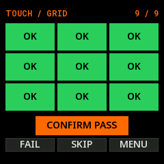

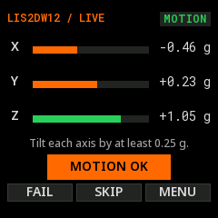

每项可以按页面 FAIL/SKIP/MENU 处理，全部项目处理后出现总结。**完成一轮不等于全部 PASS**。`RUN AGAIN` 清空本轮结果重新测试，`TEST MENU` 回测试菜单；结果只保存在本次 Lua 会话中，没有自动保存报告。

RGB 正常完成路径会先发黑色关灯，再释放资源；BOOT 强制请求退出时不应假定所有外设已执行某个业务收尾动作。外部电机、加热等负载应有独立硬件安全措施，不能只依赖脚本退出。

## 12 · DISPLAY 显示设置

进入 `SETTING → DISPLAY`。设置包括方向、空闲息屏和亮度。

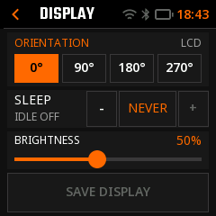

| 设置 | 可选范围/行为 |
| --- | --- |
| 方向 | 0°、90°、180°、270°；使用 ST7789 硬件方向，触摸坐标同步 |
| 休眠 | 15 秒、30 秒、60 秒、300 秒、Never；用于空闲背光管理，不是设备关机 |
| 亮度 | 10%～100%，每步 5%；数值为 PWM 比例，不是校准后的实际光强 |

亮度拖动即时预览；点 `SAVE DISPLAY` 后才持久保存。未保存离页会要求处理草稿：`KEEP EDITING` 继续编辑，`DISCARD` 放弃并恢复已确认亮度。保存方向和亮度后，下次屏幕初始化就使用保存值，不必等进入菜单才切换。

首次无配置时，当前默认值为 0°、Never、50% 亮度；已有设备配置不会因升级版本号自动恢复默认。失败或结果不确定时，以页面提示为准，不能仅凭预览变亮就断定已写入。

息屏后第一次触摸用于唤醒，这次完整触摸会被系统消耗，不会顺带点击下面的按钮。亮屏后再正常操作。息屏不表示 Lua 或网络服务必然停止。

## 13 · 上传自己的 Lua 与能力边界

建议先复制一份出厂工具或仓库中的示例再修改，使用短英文文件名和英文界面文案。原生静态字库不覆盖任意中文，元信息中的非 ASCII 内容可能显示 `[NON-ASCII]`，SSID 可能显示 `?`。

### 文件头示例

```lua
-- ryz-app/1
-- @author: YourName
-- @version: 1.0.0
-- @description: Describe your app in English.
```

第一行标记放在文件开头，不加 BOM。字段区分大小写，放在实际代码之前。文件头只描述应用，不会自动帮你绘制页面；持续运行和 UI 应参考现有脚本完整结构。

### USB 上传

使用与固件匹配的 RyzoBee Studio/维护客户端，或仓库里的 USB 命令行工具。下面是在项目根目录操作的开发者示例，需先安装/使用项目要求的 Python 与串口依赖：

```sh
# PORT 替换为本机实际识别的 RyzoBee 串口；不要原样输入 PORT。
python firmware/rootmaker/tools/board_lua.py --port PORT put my_tool.lua
```

先退出运行中的脚本，并关闭其它占用同一串口的软件。上传后在设备 APPS 查找文件，再按住运行 2 秒。若文件已经存在，覆盖会改变设备中的该文件，先保存需要保留的源码。

`board_lua.py run` 是另一个短执行路径，默认超时约 1 秒，不适合作为持续 Monitor 等工具的启动方式。配网网页、诊断网页和未开放的 FILE SERVER 不能替代 USB 上传。

### 第一次动手：上传现成 UI 示例

配套仓库有一个不驱动外部硬件的最小界面示例，可从项目根目录上传：

```sh
python firmware/rootmaker/tools/board_lua.py --port PORT \
  put firmware/rootmaker/scripts/ui_demo.lua --name ui_demo.lua
```

从设备 APPS 选择 `ui_demo.lua`，按住 2 秒运行。示例挂载一个带三个按钮的页面；点击任一按钮后输出事件并正常结束回 HOME。示例里的 `APPS / SETTINGS / ABOUT` 是脚本自己的按钮，不会打开系统设置。上传不会自动运行，也不会自动设置自启。继续开发时可从这个示例学习 `ui.mount`、`ui.poll` 与主循环，再参考三份出厂工具。

### 当前限制

| 项目 | 本版规则 |
| --- | --- |
| 文件 | `.lua`，短英文文件名；名称主体用字母、数字、下划线、连字符，全名最多 30 字节 |
| 源码大小 | 每文件 1～16,384 字节，不支持内嵌 NUL |
| 文件目录 | 最多索引 256 个 Lua 文件；受 1 MiB 文件系统实际容量限制 |
| 用户任务 | 同时一个，运行结束销毁独立 Lua VM，不跨任务保留全局变量 |
| Lua 堆 | 每任务 256 KiB，协程共享；不是全部 2 MiB PSRAM 都能由一个任务占满 |
| UI | 有界声明式入口，box/label/button/viewport/image，单场景最多 32 个对象；不是完整裸 LVGL 绑定 |
| 协程 | 可用，但为合作式调度；共享取消、超时与内存限制，sleep 不会自动调度另一个协程 |
| 字体 | 默认静态字库；FreeType 默认关闭 |
| 外设资源 | 单任务最多 16 个通用句柄；通用单事务数据有 256 字节边界，显式等待参数最多 20 ms |
| 模块组织 | 不是任意多文件包部署环境，不应假设可以 require 文件系统里的任意模块 |

Lua 可使用显示、触摸、UI、GPIO、定时器、PWM、I²C、SPI、UART、ADC、日志、LED、IMU、HID 等已开放能力。**引脚仍受保留/占用/租约限制，不代表任意 GPIO 都能用。**IMU 由脚本显式初始化；Wi-Fi/BLE 的配置、扫描、配对与凭据留在系统层，脚本只查询连接状态并在满足条件后继续业务。

高级接口与完整示例请查看配套仓库 `docs/software/firmware-lua-peripherals.md`、`docs/software/firmware-lua-platform.md` 和 `firmware/rootmaker/fs/tool_*.lua`。使用同版本文件，避免复制旧文档中的工具专属接口或过时的长按时间。

## 14 · 脚本异常与诊断报告

运行、语法、超时等异常可能进入 `SCRIPT HALTED`。正常结束和正常 BOOT 停止不会被当成脚本错误。

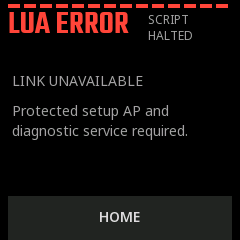

常见类别包括 `LUA-R01` 运行错误、`LUA-S01` 语法错误、`LUA-T01` 超时。先记录完整错误文字，再选择 `HOME` 返回并修改脚本；`VALID` 并不免除运行错误。

### 查看完整报告

1. 若错误页提供 `JOIN DEVICE WI-FI`，使用**手机系统相机或系统扫码器**扫描设备上的第一张二维码，按系统提示加入已有受密码保护的 AP。
2. 点 `NEXT`，继续使用**手机系统自带扫码功能**扫描第二张 `SCAN FOR DIAGNOSTICS` 网址二维码，再打开浏览器中的诊断报告。不要改用第三方 App 的“扫一扫”。
3. 网页查看错误、代码位置、运行时长、峰值内存和有限输出；可复制错误/报告，或下载 `.TXT`。
4. 及时保存。报告只在内存里保留，约 10 分钟过期，也可能被新报告覆盖，重启后消失。

如果显示 `LINK UNAVAILABLE`，说明当前安全 AP 或诊断服务不可用。错误处理不会偷偷开启热点；这不是“二维码漏画”。可以先记录屏幕错误、回 HOME 配置网络，再在可控条件下重新复现。

诊断网页只读，不执行命令、不上传 Lua、不自动重跑脚本，也不是实时日志终端。报告可能含用户脚本打印的个人信息或密钥，分享前检查并删去敏感内容。Wi-Fi QR 同样含热点凭据，不应公开传播。

## 15 · 版本、升级与数据保留

在 `SETTING → VERSION` 查看设备实际固件版本，信息页可滚动查看构建、运行和设备信息。V0.10.1 源码的项目版本为 `0.10.1`；手册中的 V 是显示前缀，不是另一套版本。

本次版本包含：Wi-Fi/BLE 开始按钮触摸热区扩大、APP INFO 2 秒运行门槛，以及按钮背景填充反馈。其它功能按本指南所列范围提供。

**当前在线更新尚未开放。**虽然已有 HTTPS OTA、镜像校验和 A/B 分区基础组件，但当前 `CONFIG_RYZ_OTA_URL` 为空，没有用户可用更新源。模拟器中的 AVAILABLE/DOWNLOADING/REBOOT 等页面是状态样例，不表示有服务器可下载新固件。

升级请使用维护端提供的匹配固件及烧录流程，并在操作前确认范围：

- **全量项目烧录**通常覆盖启动程序、分区表、OTA 元数据、应用和 scripts 分区。设备上后来上传/修改的脚本可能丢失，应先另存源码。
- 当前约定的全量流程不擦 NVS，因此 Wi-Fi/BLE 偏好、绑定与显示配置通常保留；它不等于恢复出厂设置。
- 普通重启不会重新安装被删的出厂脚本；全量写入脚本镜像才会覆盖为镜像内的内容。
- 构建成功、写入校验通过、应用正常启动、功能验收是不同阶段。看到版本号不代表所有外设已测通过。

## 16 · 常见问题与建议验收顺序

| 现象 | 建议处理 |
| --- | --- |
| 点击脚本只进详情 | 正常。请在详情连续按住 HOLD 2S TO RUN |
| 长按没运行 | 保持手指稳定；滑动、提前松手、页面/文件状态变化会取消；查看是否 PREPARING 或不可用 |
| APPS 显示 ACTION FAILED - SELECT AGAIN | 返回列表重新选择，让设备取得最新文件信息；不能仅凭这句判断文件系统崩溃 |
| 显示 OUTCOME UNKNOWN / DO NOT RETRY | 不要连续重试写入/删除，先核对真实文件或任务状态并保留日志 |
| CREATED / MODIFIED 为 - | 时间未知；先完成网络校时，再进行后续上传，不能伪造原文件历史时间 |
| 明明有脚本，STORAGE 很小 | 文件可能只占不足 1%，应显示 <1%；文件体积与运行堆不是一回事 |
| 有 3 份工具却看见 4 个文件 | 检查是否设置了独立 boot.lua，或自己上传了文件；不是“六份缓存等于六个脚本” |
| 每次开机直接进入工具 | 已有 boot.lua；BOOT 5 秒回 HOME 后清除开机脚本 |
| 手机连设备 AP 后没互联网 | 正常，本地 AP 用于配网/诊断；浏览器访问设备屏幕 IP |
| 扫到热点但不知密码 | 使用设备实时入网二维码；不存在可通用猜测的默认 AP 密码 |
| 扫码后只看到一串文字，没有加入 Wi-Fi 提示 | 确认使用手机系统相机或系统扫码器，而非微信等第三方 App；检查系统二维码识别功能，再扫描设备实时二维码 |
| Wi-Fi 名称显示 ? | 原生静态字库限制；不代表实际 SSID 字节或二维码被改写 |
| BLE 显示 SAVED 但没连上 | SAVED 只是绑定记录，核对对端状态；新手机需要独立新配对流程 |
| nRF 能扫到而 iPhone 设置找不到 | 可能是系统展示/兼容性差异；按 BLE 章节排查，本版不承诺所有 iPhone 无 App 发现 |
| 时间差了 8 小时 | 当前时区为 UTC，不是中国标准时间；当前没有用户时区设置入口 |
| 息屏后第一下没点中 | 第一次完整触摸被用于唤醒，亮屏后再点 |
| Monitor 暂停后仍提示丢数据 | 暂停只冻结显示，接收仍在继续；历史/缓冲有上限 |
| I²C 扫不到地址 | 核对总线选择、供电、接线、上拉和频率；ACK 不等于器件功能已通过 |
| BATTERY / FILE SERVER / OTA 不可用 | 当前能力限制，不要通过反复点击推断故障 |

### 建议按这个顺序体验

1. 启动到 HOME，查看菜单、时间/状态占位及静态文字。
2. 在 APPS 找工具，短按进详情；按住不足 2 秒松手，确认不运行；再完整按住 2 秒运行。
3. 运行后 BOOT 约 5 秒退出，重复一次确认能重新启动。
4. 运行 Monitor，尝试 PAUSE 后上下拖动、RESUME、CLEAR。
5. 调整 DISPLAY 亮度观察预览，放弃修改确认恢复，再 SAVE 并正常重启确认保存。
6. 按 Wi-Fi 章节从实际 AP 配网；BLE 按实际手机单独验收，不混同两个连接结果。
7. 最后设置已验证的开机脚本；确认开机直达、BOOT 退出和 CLEAR BOOT 都符合预期。

需要反馈问题时，请记录：设备实际版本、所在页面、操作顺序、屏幕完整错误、是否设置自启、是否正在配网/配对，以及问题照片或脱敏诊断报告。不要只报告“卡了”，也不要公开密码或真实配对码。

---

**编制依据与证据边界**  
本指南以配套仓库当前 C/LVGL 页面、Workbench 业务接线、默认配置及三份出厂 Lua 为依据，而非将历史设计稿直接当作功能清单。截图由同源 Host/SDL 运行生成；测试中的文件、网络、传感器和运行状态采用明确夹具。它们能帮助解释界面，不证明真实无线互通、触摸精度、硬件测量或数据耐久性已完成验收。以实际板卡和固件反馈为准。
